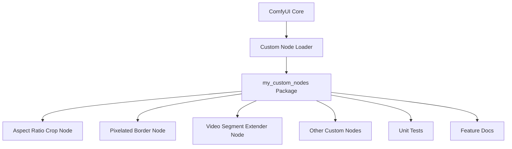

# Architecture Overview

**Audience:** Developers, architects

---

## Objectives and Context

My-custom-nodes extends ComfyUI with custom nodes for advanced image and video processing. The architecture is modular, enabling easy addition of new nodes and seamless integration with the ComfyUI workflow engine.

## General Diagram

## Main Components

- **ComfyUI Core:** The main workflow engine and UI.
- **Custom Node Loader:** Mechanism in ComfyUI to discover and load external nodes.
- **my_custom_nodes Package:** Contains all custom node implementations.
- **Nodes:** Each node (e.g., aspect ratio crop, pixelated border, video segment extender) is a Python module/class.
- **Tests:** Pytest-based unit tests for each node.
- **Docs:** Feature and agent documentation for maintainability and onboarding.

## Data Flow

1. User creates a workflow in ComfyUI.
2. Custom nodes from `my_custom_nodes` are available in the node palette.
3. Data (images, video frames) flows through nodes as defined by the workflow.
4. Each node processes input and produces output for downstream nodes.

## Patterns and Principles

- **Modular design:** Each node is independent and reusable.
- **Extensibility:** New nodes can be added with minimal changes.
- **Testability:** All nodes are covered by unit tests.
- **Documentation-first:** Feature and agent docs accompany code changes.

## Important Decisions

- Use of [cookiecutter-comfy-extension](https://github.com/Comfy-Org/cookiecutter-comfy-extension) for project scaffolding.
- Adherence to ComfyUI’s node interface for compatibility.
- Use of Pytest, Mypy, Ruff, and Pre-commit for code quality.

## External Integrations

- **ComfyUI:** Main dependency and runtime environment.
- **ComfyUI-Manager:** For easy installation and updates.

## Security / Scalability Considerations

- Nodes are sandboxed by ComfyUI’s execution model.
- Code quality tools (Mypy, Ruff) help prevent common errors.
- Modular structure supports scaling with more nodes and features.

---

For more details, see the [modules overview](modules.md) and [feature docs](features/).
